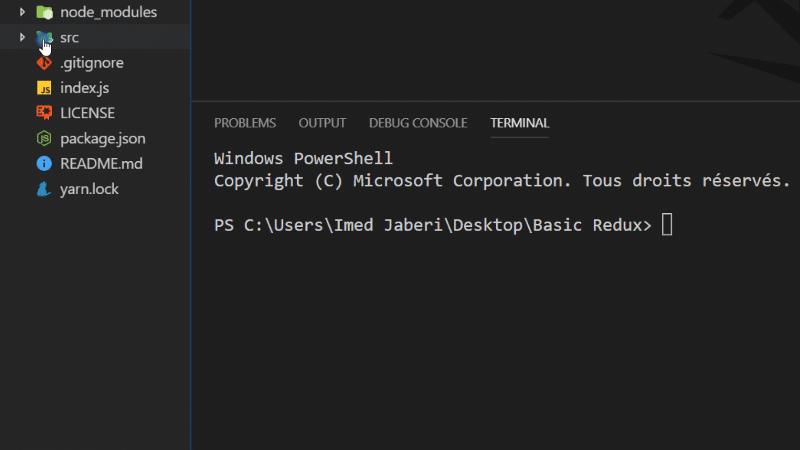

# REDUX-VANILLA-JS
---
### This project is a basic redux implementation with native javascript ...

## What technologies that i used ?
 - ECMASCRIPT 2016 ( JavaScript )
 - Node JS ( Run-Time Environment ) 10.15.0
 - Redux ( Predictable State Container ) 4.0.1


## Setup prerequists
 - you have to install NodeJS as it's the service and also to use its package manager npm.

## How to run the application
 - Clone or download files in some place.
 - Open CMD or Terminal in the root folder you just cloned.
 - Write this command ``` npm run start ``` to run the app.

## Demo 

  
#### License
---
[MIT](https://choosealicense.com/licenses/mit/)  

